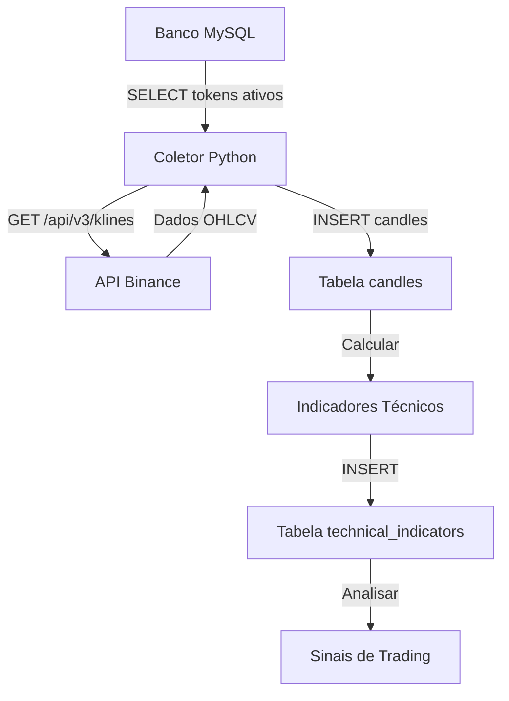

# BinanceImporter - Sistema de Coleta e Análise de Candles

## 🎯 Visão Geral

O BinanceImporter é um sistema completo para coleta, armazenamento e análise de dados de candles da **API gratuita da Binance**. O sistema funciona da seguinte forma:

1. **Puxa tokens ativos** do banco de dados (tabela `tokens`)
2. **Faz requisições** para API da Binance (`/api/v3/klines`)
3. **Armazena dados** com controle de duplicatas
4. **Calcula indicadores técnicos** automaticamente
5. **Detecta sinais de trading**

### ✨ Características Principais:

- 🔄 Coleta automatizada e contínua
- 🗄️ Armazenamento otimizado em MySQL
- 📊 Indicadores técnicos (RSI, MACD, Bollinger, etc.)
- 🎯 Detecção de sinais de trading
- 📋 Sistema completo de logs e monitoramento
- 🪟 **Suporte total para Windows**

## 📁 Estrutura do Projeto

```
BinanceImporter/
├── config.py                 # Configurações do sistema
├── candle_collector.py        # Coletor principal de candles
├── technical_indicators.py    # Gerador de indicadores técnicos
├── test_connection.py         # Teste de conectividade
├── database_structure.sql     # Estrutura do banco de dados
├── requirements.txt           # Dependências Python
├── .env                      # Variáveis de ambiente
├── install.bat               # Instalação Windows
├── run.bat                   # Execução Windows
├── quick_start.bat           # Menu interativo Windows
├── monitor.bat               # Monitoramento Windows
├── backup.bat                # Backup Windows
└── README.md                 # Este arquivo
```

## 🚀 Instalação

### 🪟 **Windows (Recomendado)**

1. **Execute a instalação automática:**
```batch
install.bat
```

2. **Edite o arquivo .env:**
```env
DB_HOST=localhost
DB_PORT=3306
DB_NAME=binanceimporter
DB_USER=root
DB_PASSWORD=sua_senha_aqui
```

3. **Importe a estrutura do banco:**
```sql
mysql -u root -p binanceimporter < database_structure.sql
```

4. **Teste a conectividade:**
```batch
test.bat
```

### 🐧 **Linux/Mac**

1. **Configure ambiente virtual:**
```bash
python3 -m venv venv
source venv/bin/activate
pip install requests>=2.28.0 mysql-connector-python>=8.0.32 python-dotenv>=1.0.0 schedule>=1.2.0 numpy pandas
```

2. **Configure .env e banco igual ao Windows**

## 🎮 Uso

### 🪟 **Windows - Início Rápido**

```batch
# Menu interativo completo
quick_start.bat

# Execução automática (coleta contínua + indicadores)
run.bat

# Monitoramento em tempo real
monitor.bat
```

### 📋 **Comandos Principais**

#### **1. Coleta de Candles**

```batch
# Coleta única padrão (1h, 100 candles, todos os tokens)
python candle_collector.py single

# Coleta personalizada
python candle_collector.py single 15m 500

# Coleta contínua (múltiplos intervalos)
python candle_collector.py continuous 1h,4h,1d

# Preencher dados faltantes
python candle_collector.py fill BTCUSDT 1h 30
```

#### **2. Indicadores Técnicos**

```batch
# Calcular indicadores para todos os tokens
python technical_indicators.py calculate 1h

# Ver sinais de trading
python technical_indicators.py signals

# Sinais para token específico
python technical_indicators.py signals BTCUSDT 1h
```

#### **3. Modo Interativo**

```batch
# Menu completo com todas as opções
python candle_collector.py
```

## 📊 Fluxo de Funcionamento



### 🔄 **Processo Automático:**
1. Sistema consulta `active_trading_tokens` (tokens com status='TRADING')
2. Para cada token faz requisição: `https://api.binance.com/api/v3/klines?symbol=BTCUSDT&interval=1h`
3. Processa dados e insere na tabela `candles` (sem duplicatas)
4. Calcula indicadores técnicos baseados nos candles
5. Identifica sinais de compra/venda automaticamente

## 🗄️ Estrutura do Banco de Dados

### **Tabelas Principais**

#### 📈 `candles` - Dados OHLCV
```sql
- symbol (BTCUSDT, ETHUSDT, etc.)
- interval_type (1m, 5m, 1h, 4h, 1d)
- open_time, close_time (timestamps)
- open_price, high_price, low_price, close_price
- volume, quote_asset_volume
- number_of_trades
- Índice único: (symbol, interval_type, open_time)
```

#### ⚙️ `collection_control` - Controle de Coleta
```sql
- symbol, interval_type
- last_collected_time (último timestamp coletado)
- status (active/paused/error)
- error_count, last_error
```

#### 📋 `collection_logs` - Logs Detalhados
```sql
- symbol, interval_type, collection_type
- start_time, end_time, records_collected
- status, error_message, execution_time
```

#### 📊 `technical_indicators` - Indicadores Técnicos
```sql
- symbol, interval_type, timestamp
- current_price
- sma_20, sma_50, ema_12, ema_26
- rsi_14, macd_line, macd_signal, macd_histogram
- bb_upper, bb_middle, bb_lower
- stoch_k, stoch_d
- volume_sma_20, volume_ratio
- resistance_20, support_20
```

### 🔍 **Views Utilitárias**

- **`active_trading_tokens`**: Tokens ativos para coleta
- **`latest_candles`**: Últimos candles por símbolo
- **`collection_stats`**: Estatísticas de coleta
- **`basic_indicators`**: Indicadores das últimas 24h
- **`data_gaps`**: Identifica lacunas nos dados

## 💡 Exemplos de Análise SQL

### 📊 **Top 10 por Volume (24h)**
```sql
SELECT 
    symbol,
    SUM(volume) as volume_24h,
    AVG(number_of_trades) as avg_trades
FROM candles 
WHERE open_time >= (UNIX_TIMESTAMP(NOW() - INTERVAL 24 HOUR) * 1000)
    AND interval_type = '1h'
GROUP BY symbol 
ORDER BY volume_24h DESC 
LIMIT 10;
```

### 📈 **Tokens Mais Voláteis (7 dias)**
```sql
SELECT 
    symbol,
    ((MAX(high_price) - MIN(low_price)) / MIN(low_price) * 100) as volatility_percent
FROM candles 
WHERE open_time >= (UNIX_TIMESTAMP(NOW() - INTERVAL 7 DAY) * 1000)
    AND interval_type = '4h'
GROUP BY symbol 
ORDER BY volatility_percent DESC 
LIMIT 15;
```

### 🎯 **RSI em Zona de Sobrevenda**
```sql
SELECT 
    ti.symbol,
    ti.current_price,
    ti.rsi_14,
    ti.volume_ratio
FROM technical_indicators ti
WHERE ti.rsi_14 < 30 
    AND ti.volume_ratio > 1.2
    AND ti.interval_type = '1h'
ORDER BY ti.rsi_14 ASC;
```

### 🚀 **Breakouts de Resistência**
```sql
SELECT 
    ti.symbol,
    ti.current_price,
    ti.resistance_20,
    ((ti.current_price - ti.resistance_20) / ti.resistance_20 * 100) as breakout_percent
FROM technical_indicators ti
WHERE ti.current_price > ti.resistance_20 * 1.02
    AND ti.volume_ratio > 1.5
ORDER BY breakout_percent DESC;
```

## 🔧 Scripts de Automação Windows

### 📋 **monitor.bat** - Monitoramento em Tempo Real
```batch
# Mostra status do sistema a cada 60 segundos
monitor.bat
```
- ✅ Status dos processos em execução
- 📊 Últimas coletas realizadas  
- ❌ Tokens com erro
- 📈 Estatísticas em tempo real

### 💾 **backup.bat** - Backup Automático
```batch
backup.bat
```
- 🗄️ Backup da estrutura do banco
- 📊 Backup dos dados (últimos 30 dias)
- 📅 Nomeação automática por data

### ⚙️ **Configuração de Tarefas Agendadas (Windows)**
```batch
# Abrir Agendador de Tarefas
taskschd.msc

# Criar tarefa para:
# - Coleta contínua: Executar run.bat na inicialização
# - Backup diário: Executar backup.bat às 2h da manhã
# - Monitoramento: Executar monitor.bat a cada hora
```

## 🛠️ Monitoramento e Manutenção

### 📊 **Verificar Status do Sistema**
```python
# Via Python
from candle_collector import DatabaseManager

db = DatabaseManager()
query = """
SELECT 
    symbol, interval_type, status,
    FROM_UNIXTIME(last_collected_time/1000) as last_collection,
    error_count
FROM collection_control 
WHERE status = 'error' 
    OR last_collected_time < (UNIX_TIMESTAMP(NOW() - INTERVAL 2 HOUR) * 1000)
"""
problems = db.execute_query(query, fetch=True)
```

### 🚀 **Otimização de Performance**
```sql
-- Índices adicionais para consultas frequentes
CREATE INDEX idx_candles_symbol_time ON candles(symbol, open_time);
CREATE INDEX idx_indicators_symbol_time ON technical_indicators(symbol, created_at);

-- Limpeza de dados antigos (manter apenas essenciais)
DELETE FROM candles 
WHERE open_time < (UNIX_TIMESTAMP(NOW() - INTERVAL 90 DAY) * 1000)
    AND interval_type IN ('1m', '3m', '5m');
```

## 🔍 Análise de Dados Avançada

### 📈 **Correlação entre Tokens**
```python
import pandas as pd
from candle_collector import DatabaseManager

# Buscar dados para matriz de correlação
query = """
SELECT symbol, open_time, close_price 
FROM candles 
WHERE interval_type = '1h' 
    AND open_time >= (UNIX_TIMESTAMP(NOW() - INTERVAL 30 DAY) * 1000)
"""

df = pd.DataFrame(db.execute_query(query, fetch=True))
price_matrix = df.pivot(index='open_time', columns='symbol', values='close_price')
correlation = price_matrix.corr()

print("Tokens mais correlacionados com BTC:")
print(correlation['BTCUSDT'].sort_values(ascending=False).head(10))
```

### 🎯 **Detecção de Padrões**
```python
def detect_double_bottom(lows, window=20):
    """Detecta padrão de fundo duplo"""
    patterns = []
    for i in range(window, len(lows) - window):
        left_min = min(lows[i-window:i])
        right_min = min(lows[i:i+window])
        current_low = lows[i]
        
        # Verifica se forma fundo duplo
        if (abs(left_min - right_min) / left_min < 0.02 and 
            current_low <= left_min * 1.01):
            patterns.append({
                'index': i,
                'pattern': 'double_bottom',
                'support_level': current_low
            })
    return patterns
```

## ❓ Troubleshooting

### 🔧 **Problemas Comuns**

#### ❌ **Erro de conexão MySQL**
```batch
# Verificar se MySQL está rodando
net start mysql

# Testar conexão
test.bat
```

#### ⚠️ **Rate limiting da Binance**
- Sistema já tem controle automático (0.1s entre requisições)
- Em caso de erro 429: aguardar 1 minuto e reiniciar

#### 📊 **Gaps nos dados**
```python
# Preencher dados faltantes
python candle_collector.py fill BTCUSDT 1h 30
```

#### 🐌 **Performance lenta**
```sql
-- Verificar tamanho das tabelas
SELECT 
    table_name,
    ROUND(((data_length + index_length) / 1024 / 1024), 2) AS 'DB Size (MB)'
FROM information_schema.tables 
WHERE table_schema = 'binanceimporter';

-- Limpar dados antigos se necessário
```

### 📋 **Logs e Debug**
```batch
# Ver logs em tempo real
type binance_importer.log

# Habilitar debug detalhado no config.py
LOGGING_CONFIG = {'level': 'DEBUG', ...}
```

## 🚀 Próximos Passos

### 🎨 **Possíveis Expansões:**
1. **Dashboard Web**: Interface visual com gráficos
2. **Alertas por Email/Telegram**: Notificações de sinais
3. **Backtesting**: Teste de estratégias históricas  
4. **Machine Learning**: Modelos preditivos
5. **API REST**: Exposição dos dados via API

### 📊 **Indicadores Adicionais:**
- Fibonacci Retracements
- Ichimoku Cloud
- Volume Profile
- Order Book Analysis

## 📞 Suporte

### 🆘 **Em caso de problemas:**
1. Execute `test.bat` para verificar conectividade
2. Verifique logs em `binance_importer.log`
3. Consulte tabela `collection_logs` para erros específicos
4. Use `monitor.bat` para acompanhar status em tempo real

### ✅ **Sistema funcionando quando:**
- ✅ `test.bat` passa em todos os testes
- ✅ `monitor.bat` mostra coletas recentes
- ✅ Tabela `candles` recebe dados constantemente
- ✅ Indicadores são calculados regularmente

---

## 🎉 **Sistema Pronto!**

Após a instalação, o BinanceImporter funciona **100% automaticamente**:
- 🔄 Coleta dados continuamente da Binance
- 📊 Calcula indicadores técnicos
- 🎯 Identifica sinais de trading
- 📋 Mantém logs detalhados
- 🛡️ Controla duplicatas e erros

**Execute `quick_start.bat` e comece a usar agora!** 🚀

---

## 📋 Checklist de Instalação

### ✅ **Pré-requisitos**
- [ ] Python 3.8+ instalado
- [ ] MySQL Server rodando
- [ ] Banco `binanceimporter` criado
- [ ] Tabela `tokens` populada com dados da Binance

### ✅ **Instalação**
- [ ] Executar `install.bat`
- [ ] Configurar `.env` com dados do MySQL
- [ ] Importar `database_structure.sql`
- [ ] Testar com `test.bat`

### ✅ **Primeira Execução**
- [ ] Executar `quick_start.bat`
- [ ] Escolher opção 1 (coleta única)
- [ ] Verificar dados na tabela `candles`
- [ ] Calcular indicadores (opção 4)

### ✅ **Produção**
- [ ] Configurar `run.bat` para inicialização automática
- [ ] Agendar `backup.bat` diariamente
- [ ] Monitorar com `monitor.bat`

---

## 🔗 Links Úteis

- **Documentação API Binance**: https://binance-docs.github.io/apidocs/spot/en/
- **MySQL Documentation**: https://dev.mysql.com/doc/
- **Python MySQL Connector**: https://dev.mysql.com/doc/connector-python/en/
- **Análise Técnica**: https://www.investopedia.com/technical-analysis-4689657

---

## 📄 Licença

Este projeto é fornecido "como está" para fins educacionais e de desenvolvimento. Use por sua própria conta e risco. Sempre teste em ambiente de desenvolvimento antes de usar em produção.

---

**🎯 Sistema totalmente funcional e pronto para coleta automatizada de dados da Binance!** necessário

3. **Gaps nos dados**
   - Executar script de preenchimento
   - Verificar logs de erro
   - Ajustar timeouts da API

4. **Performance lenta**
   - Adicionar índices otimizados
   - Implementar particionamento
   - Limpar dados antigos

### Logs e Debug
```python
# Habilitar debug detalhado
import logging
logging.basicConfig(level=logging.DEBUG)

# Verificar última atividade
tail -f binance_importer.log | grep ERROR
```

## Próximos Passos

1. **Dashboard Web**: Interface para visualização dos dados
2. **Alertas**: Sistema de notificações para sinais importantes  
3. **Backtesting**: Framework para testar estratégias
4. **Machine Learning**: Modelos preditivos baseados nos dados
5. **API REST**: Exposição dos dados via API própria

## Suporte

Para problemas ou sugestões:
1. Verificar logs do sistema
2. Consultar esta documentação
3. Revisar configurações do banco de dados
4. Testar conectividade com a API da Binance